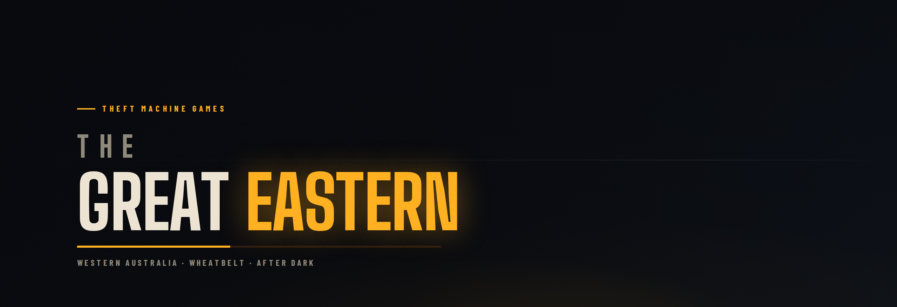
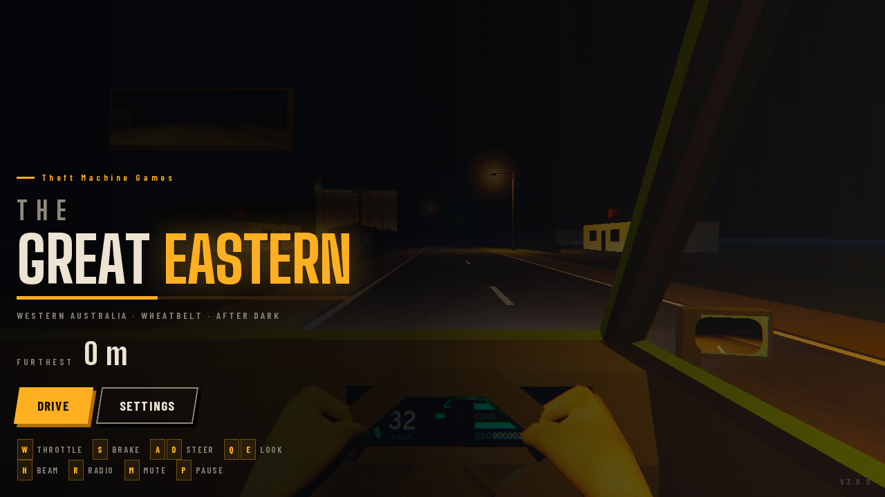
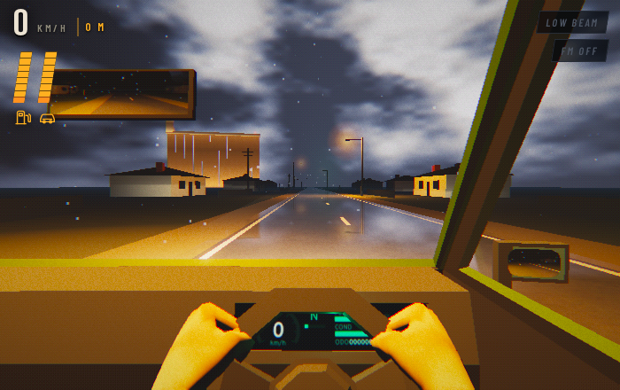
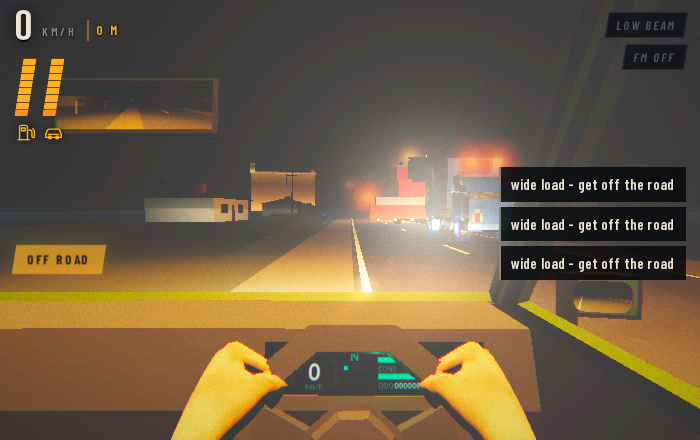
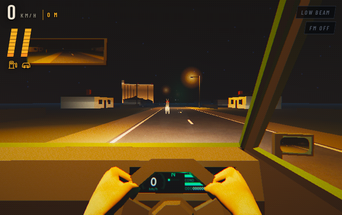
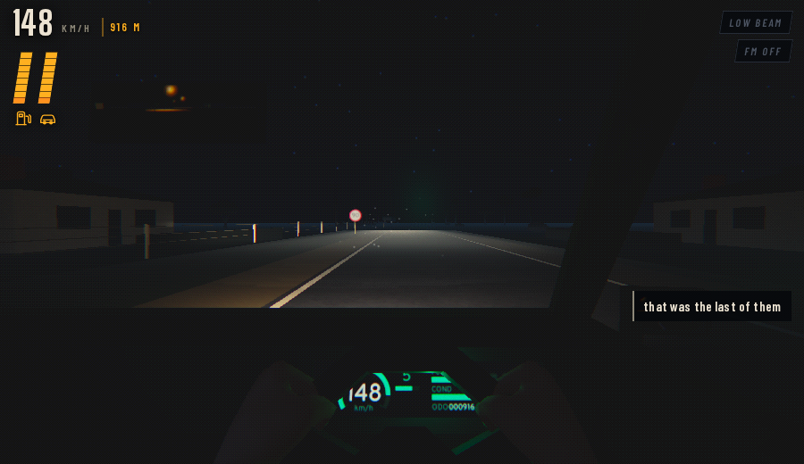
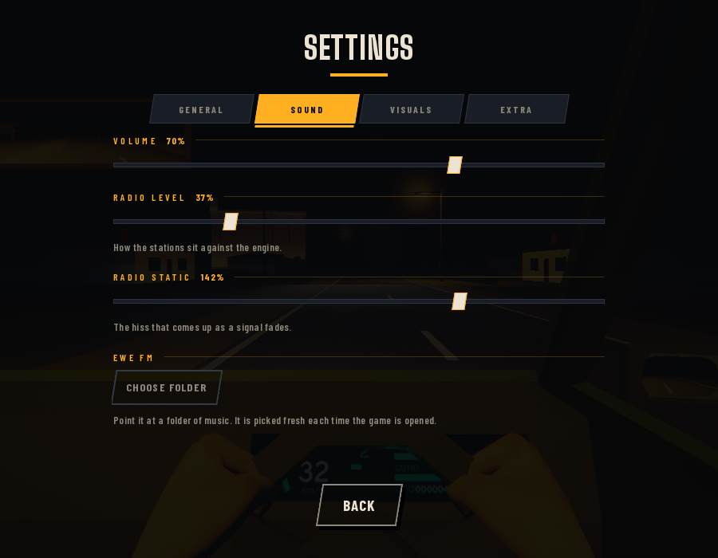

  

  <b>An endless night drive through the Western Australian wheatbelt.</b> 
  One HTML file · No engine, no install, no network · Three.js + WebGL

  
  
  
  

---

You are on the highway east of Perth at some hour past midnight, and the road
runs dead straight through wheat stubble and salt lakes for as far as the
headlights reach. There is no finish line and no score to chase. There is a
tank of fuel, a radio, and however far you feel like going.

> **Calm, then briefly not calm, then calm again.**

  

## The road

Nothing is placed by hand. The whole road is generated from a seed, which the
game prints when you start — so if you find one you like, you can drive it
again with `?seed=` in the URL.

Towns come about every forty kilometres, with main streets, shopfronts, grain
silos floodlit from three kilometres out, roadhouses, and speed limits the
traffic actually obeys. Between them: avenues where old planted gums close over
the road and your lights stop reaching into paddocks and start raking along
trunks two metres away. Canola in flower on one side and stubble on the other.
Rest areas, level crossings, fence lines, side roads, and a lot of dark.

## Driving

| | | | |
|:--|:--|:--|:--|
| **169** km/h flat out | **46** litre tank | **110** open road limit | **∞** kilometres of it |

Off the tarmac there is gravel, and gravel costs you grip, speed and a plume of
dust — but the shoulder is wide and it is a legitimate place to be. Locals use
it to duck oncoming traffic at the last moment, and the game is built expecting
you to.

Two things end a run: the fuel and the car. Fuel comes from roadhouses. The car
repairs itself slowly if you pull onto the verge and wait.

## The police

Parked on the verge every ten kilometres or so with their lights off. Pass one
over the limit and it comes after you — and you will hear the siren well before
anything appears in the mirror.

The rule that decides every pursuit is simple enough to read off the speedo:

| | |
|:--|:--|
| **Above 120 km/h** | They sit five km/h behind you and cannot touch you. You are always being chased and always getting away — about a hundred metres a minute, slow enough to keep the mirror full. |
| **Below 120 km/h** | They are faster than you, and they will run you off the road. |

So a pursuit is a decision about the next corner, the next town, the next road
train. Anything that makes you lift is what gets you caught.

They read the road too. They will overtake traffic on the wrong side if it is
clear and on the gravel if it is not — but they take about half a second to
commit to the gravel, which is long enough for you to have put something
oncoming in the gap. The trick still works. It just has to be timed.

## Weather

Always one of four things — clear, cloudy, raining, or a thunderstorm — and it
changes roughly every five kilometres. It moves along a ladder rather than
jumping: a clear sky clouds over before it rains and rains before it storms,
and it leaves the same way.

  

Cloud, rain and lightning are three separate amounts, because they do not
arrive together. It clouds over before it rains and stays overcast long after
it stops. Rain wets the road, and a wet road throws your headlights back at you.

> **Thunder is not a bang. It rolls.**

A lightning channel is kilometres long, so sound from the far end arrives
seconds after the near end. What you hear swells, drops back, swells again, and
takes a long while to give up. How long it takes to reach you after the flash
is the only clue you get about how far away it was.

## Things that happen

Some are part of the road's furniture. Others are set pieces, and those take
turns so two never land on top of each other.

| | | |
|:--|:--|:--|
| **Kangaroos** every 3 km | **Road trains** every 4 km | **Somebody else pulled over** every 9 km |
| Two thirds cross. The rest stop dead in your lane, turn side on and watch you come — and when their nerve goes, two in five bolt back the way they came. | Forty metres of it, and at night mostly a constellation of amber clearance lights that resolves into a shape a second before it reaches you. Nothing on this road moves one. | A car on the verge, a police car behind it, lights going, someone between them with a torch. Nothing happens to you. That is the event. |
| **A wide load** every 14 km | **Fireballs** every 45 km | **The aurora, and worse** rare |
| Nine and a half metres across a seven-metre road. Everything ahead pulls onto the gravel one at a time, and that wave coming back down the road towards you is the real warning. | Not a shooting star. A bolide crossing a quarter of the sky over two to four seconds, brightening in steps as it comes apart. Then, four seconds after the light has gone, the bang. | The southern lights, if you are lucky. And something in a paddock that is over before you get there — what you meet is what it left behind. |

  
  

## The radio

Seven real Perth stations — Triple J, Nova 93.7, Gold FM, 6IX, Curtin FM,
Country and 6PR — plus **EWE FM**, which plays a folder of your own music you
point it at in the settings.

Reception is a property of *where you are*, not how long you have been
listening. It comes and goes over tens of kilometres, and the way you know a
station is going is that the hiss comes up underneath it first. Parking does
not fix it. Driving on does.

Your own music is exempt: it is coming off the seat beside you, not out of the
air, so it does not fade and it does not hiss.

Everything the game synthesises runs through an FM broadcast chain — 50 µs
pre-emphasis, heavy compression, soft clip — so it sounds like it came out of a
dashboard rather than a computer. The real stations arrive already sounding
like radio, because they are.

## Sound

**There are no samples.** Every sound in the game is synthesised as it plays.

The one worth listening for is the traffic. Every nearby vehicle has its own
voice, with the Doppler computed from the closing rate between you, level
falling off with distance squared, and tyre noise that depends on how fast it
is passing *you* rather than how fast it is going. Your own engine ducks
slightly as one goes by — yours is the constant you stop hearing, theirs is the
event.

## Looks

PS1-era rendering under a Kodak Vision3 500T grade: ordered dithering, film
grain, bloom and a vignette.

  

The headlights use a projection pattern solved from the physics of a real
dipped beam — for a road point *r* metres ahead the received light is
`I · cookie · (H/r) / r²`, so for a target illuminance the pattern must be
`E(r)·r³/(I·H)`. That is what produces the hot band under a hard cutoff, and
the kerb-side kick-up that lights the verge without dazzling anyone coming the
other way.

The interface is sodium amber and bone on a blue-black night, because those are
the only two colours on that road — street lighting and your own headlights.
Signs in the world are set in a Highway Gothic derivative, which is what
Australian road signs are actually lettered in.

## Controls

<b>Keyboard and touch</b>

 

| Key | | Key | |
|:--|:--|:--|:--|
| <kbd>W</kbd> | throttle | <kbd>H</kbd> | headlight beam |
| <kbd>S</kbd> | brake | <kbd>R</kbd> | radio |
| <kbd>A</kbd> <kbd>D</kbd> | steer | <kbd>M</kbd> | mute |
| <kbd>Q</kbd> <kbd>E</kbd> | look | <kbd>P</kbd> | pause |

On a phone: two rows of buttons across the bottom, with drag, button or tilt
steering — whichever you get on with.

## Settings

<b>Four tabs</b>

 

| Tab | |
|:--|:--|
| **General** | paint, steering, arms on the wheel, touch controls |
| **Sound** | volume, radio level and static as sliders, EWE FM folder |
| **Visuals** | graphics, brightness, street lighting, mirrors, film stock, dithering, frame rate |
| **Extra** | how often the rare things happen, and a preview mode that brings them all out at once |

  

---

  <b>Theft Machine Games</b>

